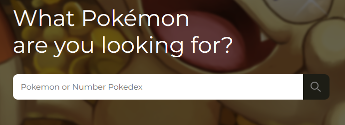
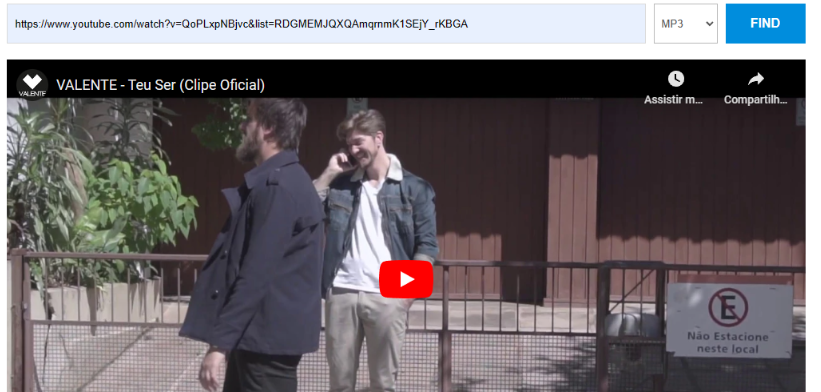
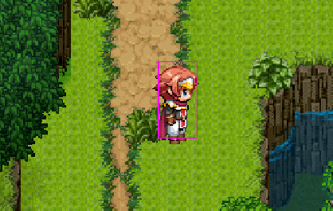

  <h1>Hi There! I'm Weslley Ivis Sousa Cutrim</h1>
  <h3>Front-end developer</h3>

    &nbsp;&nbsp;

  <a href="https://www.linkedin.com/jobs/collections/recommended/?currentJobId=3714145024&originToLandingJobPostings=3710601726%2C3697545419"><strong>weslley_reive@hotmail.com</strong></a>

 

# Projects

<strong><a href="https://github.com/WeslleyIvis/Pokedex">Pokedex</a></strong>
 

> 
Pokédex is an essential device in Pokémon games, providing detailed information about the Pokémon encountered and helping players learn about the creatures of the Pokémon world.

> 
You can find the Pokémon you want by passing the Pokémon's name or Pokédex Number

> 
It is possible to generate all Pokémon from each season.

> 
Skills: JS Vaniila, SPA, API, PokeAPI

 

<strong><a href="https://github.com/WeslleyIvis/App-Download-Music/tree/main">YTDonwloadMP3/4</a></strong>
 

> 
This application downloads music and videos from YouTube

> 
Skills: NodeJS, Jquery, API, Handlebars

  

<strong><a href="https://github.com/WeslleyIvis/Phaser_Game">Prototype Game</a></strong>
 

> 
This game was made using the "Phaser" engine with the purpose of being a prototype for building a larger game.

> 
Skills: JavaScript, TypeScript, Phaser 3, TiledMap, Json

 

<strong><a href="https://github.com/WeslleyIvis/Macro">Prototype Game</a></strong>
 

> 
Macro made in Python, using the PySimpleGUI libraries for the graphical interface and PyAutoGUI. This macro consists of pressing buttons at a time determined by the user, with up to 4 actions in use at the same time. When an action occurs, the button pressed and the number of times this action occurred is announced in the macro console.

> 
Skills: Python, PyAutogui, PySimpleGui, Multithreading

  

<!--
**WeslleyIvis/WeslleyIvis** is a ✨ _special_ ✨ repository because its `README.md` (this file) appears on your GitHub profile.

Here are some ideas to get you started:

- 🔭 I’m currently working on ...
- 🌱 I’m currently learning ...
- 👯 I’m looking to collaborate on ...
- 🤔 I’m looking for help with ...
- 💬 Ask me about ...
- 📫 How to reach me: ...
- 😄 Pronouns: ...
- ⚡ Fun fact: ...
-->
